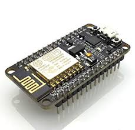
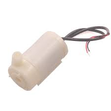
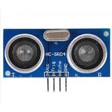
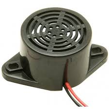
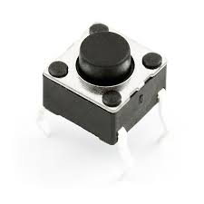

# Water-Level-Detector-and-Controller
Water Level Detector and Controller 
An NodeMCU based automatic water level controller and indicator project. Here, we are going to measure the water level by using help of ultrasonic sensors.
components used:

 1.NodeMCU 
 
 2.Micro submersible water pump. 
 
 3. Ultra sonic sensor 
 
 4. Buzzer 
 
 5. Push button 
 
